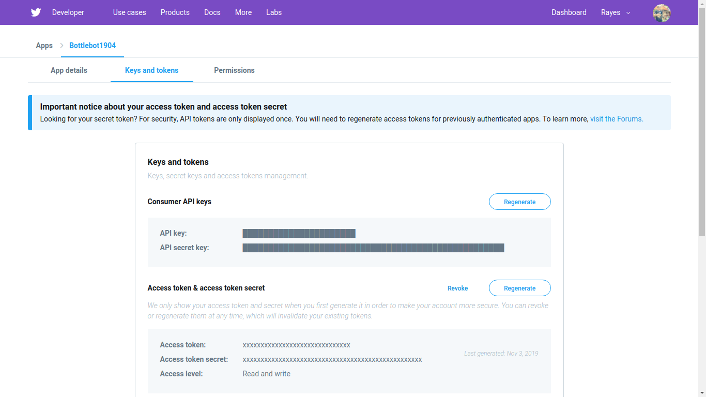

<a style="text-size=1px;color:white;"><style>
    .img-subtitle {
        font-size:smaller;
        text-align:center;
        font-style:italic;
    }
</style></a>
# Python Bot Quick Guide (ID)
Ini adalah panduan cepat untuk membuat bot Facebook, Twitter, dan Discord. Panduan ini Berbahasa Indonesia. Kunjungi semua bot sosial media yang saya buat di [maufirf.me/Bottlemin-Bots](http://maufirf.me/Bottlemin-Bots).

_Disklaimer: Panduan ini tidak sepenuhnya menggunakan istilah dalam Bahasa Indonesia karena kadang kata-kata yang dipaksakan untuk diserap ke dalam Bahasa Indonesia terlihat bodoh atau sulit diucapkan. Contohnya "Grayscale image" menjadi "Citra Skala Keabuan". Jujur saja itu terdengar bodoh di telinga saya. Ditambah, saya juga tidak akan sepenuhnya mengikuti PUEBI dan menulis panduan ini sesuka hati saya._

_Saya dengan senang hati jika anda memiliki pertanyaan, namun biasakan diri anda untuk membaca terlebih dahulu. Saya akan lampirkan server Discord saya di sini ketika sudah dibuka untuk publik._

-------------

**Selamat datang di panduan cepat membuat bot sosial media ini!**<br/>
Panduan ini tidak membahas lengkap tentang pembuatan bot sampai ke akar, karena tujuan utama dari panduan ini adalah untuk mendeploy bot secara cepat (Paling cepat kurang lebih 2-3 jam). Pengembangan bot akan diserahkan sepenuhnya kepada pembaca. Panduan lengkap akan dibuat di situs ini, ketika panduan lengkap sudah dirilis, saya akan memberi kabar di [akun Facebook pribadi saya](https://fb.me/auficertepaja).

Outline panduan pembuatan bot ini melingkupi:
- Pemrograman di **Python**;
- Menggunakan _developer tools_ yang disediakan **Facebook**, **Twitter**, atau **Discord**;
- Menyambungkan akun sosial media bot dengan programnya;
- Menaruh program bot di tempat hosting **Heroku** agar tidak perlu menyalakan dan menggoreng komputer anda karena harus nyala 24 jam x 7 hari; dan
- Moderasi posting.

Kalau kalian mengkategorikan diri kalian sebagai professional (dalam artian membuat bot dengan skala yang lebih besar secara vertikal), anda bisa juga membaca bagian professional notes<sup>#TODO</sup>.

Ketika saya sudah jago bikin bot di JavaScript, nanti saya perbaharui deh.

Prasyarat pembuatan bot ini adalah (syarat-syarat ini terserah mau anda penuhi atau tidak kalau punya preferensi sendiri, tapi ya kalau mau ikutin panduan ini, ini yang saya pake):
- Pengetahuan dasar pemrograman dengan bahasa **Python** berserta Pythonnya sendiri di komputer anda. Python dapat anda unduh [di situsnya](https://www.python.org/downloads/), namun saya juga menyarankan untuk lebih memilih [mengunduh Anaconda](https://www.anaconda.com/distribution/) dibanding Python biasa, karena Anaconda adalah Python biasa namun sebagian besar tools sudah lengkap bersama unduhannya.
- Akun di salah satu situs tujuan deployment anda, **[Facebook](https://fb.com)**, **[Twitter](https://twitter.com)**, atau **[Discord](https://discordapp.com)**.
- Akun di tempat hosting **[Heroku](https://heroku.com)**
- Version control manager **[Git](https://git-scm.com)**. Jika ingin, anda juga bisa sekaligus menggunakan GUI dari Git, saya menyarankan [Github Desktop](https://desktop.github.com/).
- Ke-anti-mager-an untuk membaca dokumentasi. Serius.
- _(OPSIONAL)_ Pengetahuan dasar **pemrograman berbasis objek**. Sebenarnya nggak perlu banget sih, tapi kalau bisa yah lebih enak jelasinnya.
- _(OPSIONAL)_ Kartu debit dengan saldo setidaknya Rp.16.000,00. Kalau lebih mah terserah, kalau pake kartu kredit mah silahkan, mau teriak ke saya ***"PERSETAN KARO ATURAN, AKU IKI WONG SUGIH"*** mah saya terima. CATATAN: tidak akan menggunakan saldo yang ada miliki kok, kecuali kalau anda wong sugih ya, sila...
- <sub><sub>_(OPSIONAL, TAPI BENERAN NGGAK PENTING-PENTING BANGET)_ Kartu x-card jenius. belum punya? silahkan ke [situsnya](https://www.jenius.com/) buat bikin yha~</sub></sub>

--------

## Pemrograman Di Python

### Pengenalan dan persiapan

Dalam panduan ini, saya mencoba untuk menurunkan knowledge base saya sebawah mungkin agar panduan ini dapat diikuti sekalipun anda bukan ~~wibu ilkom~~ programmer. Alasan saya memilih python ada 2:
1. Tentunya karena python adalah bahasa yang sering saya gunakan ketika membuat bot
2. Python adalah bahasa yang mudah dipelajari oleh pemula

Di internet, kebanyakan programmer membuat botnya di bahasa **JavaScript**, menggunakan NodeJS. Alasan utamanya karena sangat membantu dalam membentuk komunikasi dari komputer dimana programnya berada ke sosial media. Dengan JavaScript, anda bisa lebih leluasa membuat fungsi-fungsi yang anda inginkan, hanya saja dengan tuntutan lebih mandiri dalam melakukan semua hal dan butuh pengetahuan yang lebih mendalam.

Saya asumsikan anda telah menginstall Python di komputer anda. Kali ini kita akan mencoba untuk mengenali lingkungan pemrograman anda, yang berikutnya akan saya sebut _environment_.

Jika anda sudah mengerti Python bersama environmentnya, anda bisa langsung skip ke bagian [library](#). Kalau belum, silahkan buka bagian ini untuk membaca lebih lanjut:

<details>
    <summary>Penjelasan Python dan environmentnya</summary>
    Python adalah bahasa <i>interpreter</i>. Artinya, anda dapat mengetik satu baris sintaks ke dalam python, dan python akan langsung memproses secara real-time, sama seperti namanya. Ada lagi bahasa <i>compiler</i> yang membaca semua sintaks terlebih dahulu dan baru menjalankannya.<br/>
    <br/>
    Karena itu, anda bisa mulai mencoba menggunakan interpreter dari Python dengan salah satu cara di bawah ini:<br/>
    <br/>
    <b>Di Windows</b>:
    <ul>
        <li>Buka start menu, cari <code>IDLE</code>, dan buka; atau</li>
        <li>Buka Command Prompt dengan menekan, lalu ketik <code>idle</code>, lalu tekan <kbd>⏎ Enter</kbd></li>
    </ul>
    <b>Di Linux</b>:<br/>
    <i>Duh maaf sekali dari situs resminya nggak dikasih :(</i>. Gantinya, kita bisa membuka interpreternya di Terminal. Buka terminal anda dan ketik <code>python3</code> (atau pada beberapa kasus, seperti jika anda menggunakan Anaconda, <code>python</code>) untuk memastikan anda membuka Python versi 3.x.x lalu tekan <kbd>⏎ Enter</kbd>.<br/>
    <br/>
    Sekarang, kita sudah bisa mencoba melakukan pemrograman di python. Ada beberapa hal yang harus kita coba. Perlu diingat ini ini bukan panduan pemrograman dasar, jadi saya tidak akan banyak jelasin yang sifatnya dasar, namun saya akan mencoba yang terbaik.<br/>
    <ul>
        <li>
            <b>Operasi dasar</b><br/>
            Cobalah untuk mengetik ini di interpreter anda:<br/>
            <code>10 + 4</code><br/>
            Interpreter anda akan langsung mengeluarkan <code>14</code>. Operasi dasar ini bekerja untuk operasi dengan operator lainnya seperti <code>-</code>, <code>*</code>, dan <code>/</code>. Bisa anda baca di <a href="https://docs.python.org/3/library/operator.html#mapping-operators-to-functions">di dokumentasinya</a>
        </li>
        <li>
            <b>Variabel</b><br/>
            Saya yakin saat SMP anda sudah pernah belajar variabel. Kita dapat menggunakannya juga di pemrograman untuk menyimpan sebuah nilai. Sekarang coba ketik ini di interpreter anda, satu setiap baris:<br/>
            <code>a = 22</code><br/>
            <code>b = 6</code><br/>
            <code>a - b</code><br/>
            Interpreter anda akan mengeluarkan hasil <code>16</code>. Anda juga dapat langsung menyimpan hasil perhitungan variabel ke dalam variabel lagi seperti <code>c = a + b</code>.
        </li>
        <li>
            <b>Fungsi</b><br/>
            Fungsi tujuannya adalah untuk menyimpan berbagai set operasi agar dapat digunakan dimanapun tanpa mengetik semua operasinya lagi. Coba ketikkan ini di interpreter anda<br/>
            <pre>
def kali_dua_variabel(nilai1, nilai2):
    hasil = nilai1 * nilai2
    return hasil
            </pre><br/>
            lalu, coba gunakan fungsinya:<br/>
            <code>kaliDuaVariabel(23, 3)</code><br/>
            Interpreter akan mengeluarkan hasil 69. Nice. Anda juga bisa Mari kita bedah sususan fungsi itu:<br/>
            <code>def</code> adalah sintaks untuk mendefinisikan <i>"ini adalah fungsi"</i>. satu kata setelahnya akan dianggap nama fungsi, dan dalam kasus kita, kita membuat fungsi dengan nama <code>kali_dua_variabel</code>.<br/>
            Tanda kurung setelah nama (<code>(nilai1, nilai2)</code>) disebut parameter, yakni nilai input yang akan digunakan dalam fungsi. Di dalam kurung parameter itu, ada dua variabel parameter, yakni <code>nilai1</code> dan <code>nilai2</code>. Di dalam fungsi, dua parameter tersebut dapat dianggap sebagai variabel.<br/>
            <code>return</code> adalah sintaks yang menandakan <i>"Apapun yang diketik setelah ini adalah hasil yang akan dikeluarkan sebagai output fungsi."</i>. Dalam kasus kita, variabel <code>hasil</code> adalah variabel yang kita keluarkan dari fungsi sebagai hasil.
        </li>
        <li>
            <b>Modules & Library</b><br/>
            Modules bahasa mudahnya adalah folder, file, atau apapun yang membungkus kode. Untuk melihat apa yang kita maksud, kita akan mencoba membuat dua file pada python.<br/>
            File pertama, <code>file_sumber.py</code>, dan isi dengan:
            <pre>
def fungsi_contoh():
    return "hore"

def kali_dua_variabel(a, b):
    return a * b
            </pre>
            lalu pada file kedua, <code>file_tujuan.py</code>, isi dengan:
            <pre>
import file_sumber
from math import sin, cos, pi

print(file_sumber.fungsi_contoh())
print(file_sumber.kali_dua_variabel(10, 3))

def komponen_vektor(jarak, sudut):
    """
    Fungsi ini berguna untuk mereduksi vektor menjadi komponen x dan y
    """
    sudut_radian = (sudut / 180) * pi
    x = jarak * sin(sudut_radian)
    y = jarak * cos(sudut_radian)
    komponen = [round(x), round(y)]
    return komponen

print(komponen_vektor(5, 37))
            </pre>
            Jika kita jalankan file kedua, akan keluar tiga baris hasil. Dua pertama, <code>hore</code> dan <code>30</code> adalah keluaran dari fungsi yang kita tulis di file pertama. Padahal, file yang dijalankan adalah file kedua. Disitulah gunanya baris yang paling atas (<code>import file_sumber</code>: Untuk menggunakan apapun yang kita buat di fungsi pertama. Sintaks <code>import</code> gunanya untuk memasukkan fungsionalitas modul yang kita taruh di tempat lain. Dalam kasus kita, <code>file_sumber</code> adalah nama modul yang kita masukkan. Dengan kata lain, Python menganggap file Python sebagai modul.<br/>
            Perhatikan baris kedua dari file kedua (<code>from math import sin, cos, pi</code>). Itu merupakan sintaks lain dengan tujuan yang sama. <code>from</code> bertujuan untuk menunjuk dari modul mana yang ingin kita masukkan, dan setelah <code>import</code> kita menentukan <b>secara spesifik</b> fungsi atau variabel apa saja yang ingin kita masukkan. Lho, padahal kita tidak menulis file <code>math.py</code>? jawabannya, modul <code>math</code> adalah modul yang telah kita daftarkan sebagai _Library_. Modul tersebut disimpan di direktori instalasi Python sehingga bisa digunakan di file python yang kita buat kapanpun dimanapun. Kesimpulannya, library adalah modul-modul program yang sudah jadi yang ditaruh di direktori utama python.
        </li>
    </ul>
    <i>Sisanya, anda bisa pelajari dari kursus daring pemrograman yang ada di internet. Saya sendiri mempelajarinya dari kampus. Namun jika anda tidak mempelajari ini di sekolah atau kampus, anda dapat mencoba mencari situs kursus pemrograman. Saya tidak hafal situs sejenis di Indonesia, tapi saya menggunakan <a href="https://codeabbey.com">Code Abbey</a> dan <a href="https://codecademy.com">Codecademy</a> jika anda tertarik. Keduanya gratis, hanya saja yang kedua kalau mau fitur tambahan, anda harus bayar.</i>
</details>

### Library

Dalam menggunakan bahasa pemrograman, menggunakan library sudah menjadi hal yang tak terelakkan karena dapat memudahkan kita, tidak mengharuskan kita mengetik kode benar-benar dari nol. Karena kita akan melibatkan beberapa library, kita membutuhkan package manager. Package manager bekerja sesuai namanya: membantu kita mengatur package dan library, karena jika kita lakukan sendiri, itu akan sulit dan beresiko kita merusak instalasi python kita.

Package manager di python adalah `pip`. Seharusnya, `pip` sudah terinstall pada detik anda menginstall Python. sebaiknya kita pastikan `pip` sudah terinstall terlebih dahulu karena kita akan menggunakannya untuk menginstall library yang kita butuhkan. Ketik ini di command prompt (untuk windows) atau terminal (untuk linux):
```bash
pip --version
```
Jika terinstall dengan betul, maka konsol akan mengeluarkan sesuatu seperti:
```
pip 19.0.3 from /home/maufirf/anaconda3/lib/python3.7/site-packages/pip (python 3.7)
```
Jika anda menggunakan Anaconda, maka anda juga dapat menggunakan package manager dari anaconda, `conda` untuk mengunduh library.

#### Library wajib

Sekarang, kita akan menginstall library yang kita butuhkan. Sebelumnya, mari kita lihat apa saja yang kita unduh. Anda dapat menginstall yang anda butuhkan saja, semuanya, atau tidak sama sekali. Terserah sih:

- **[Tweepy](https://tweepy.org)**<br/>Tweepy adalah library API wrapper yang kita gunakan untuk menggunakan API yang diberikan oleh Twitter untuk kita. Dengan API yang diberikan itu, kita bisa nge-tweet, mencari, atau menghapus tweet menggunakan pemrograman. Untuk menginstall Tweepy, kita bisa mengetik ini di konsol untuk menginstall:
    ```bash
    pip install tweepy
    ```
    Anda bisa mempelajarinya lebih lanjut di [dokumentasinya](http://docs.tweepy.org/en/latest/index.html).
- **[Facebook-SDK](https://facebook-sdk.readthedocs.io/en/latest/)**<br/>Facebook-SDK adalah library API wrapper yang kita gunakan untuk menggunakan API yang diberikan oleh Facebook. Kurang lebih sama seperti Tweepy, hanya saja untuk facebook. Untuk menginstall, anda dapat mengetik ini di konsol untuk menginstall:
    ```bash
    pip install facebook-sdk
    ```
    Baca [dokumentasinya](https://facebook-sdk.readthedocs.io/en/latest/install.html) untuk informasi lebih lanjut.
- **[Discord.py](https://discordpy.readthedocs.io/en/latest/)**<br/>sama kayak sebelumnya tapi buat Discord. nih, capek juga gue ngetiknya:
    ```bash
    pip install -U discord.py
    ```
    Jika ingin menggunakan voice supportnya, silahkan gunakan yang ini:
    ```bash
    pip install -U discord.py[voice]
    ```
    baca [dokumentasinya](https://discordpy.readthedocs.io/en/latest/intro.html#installing) untuk informasi yang lebih lengkap.

dan untuk mengimport library tersebut, silahkan coba tes di interpreter:
```python
import tweepy
import facebook
import discord
```
Jika tidak ada error, maka semuanya bekerja dengan betul.

#### Library opsional

- **[DOTENV (.env)](https://pypi.org/project/python-dotenv/)**<br/>DOTENV adalah library yang berguna untuk mengimpor environment variable (sebuah nilai yang disimpan dalam komputer anda dan dapat digunakan di seluruh bagian sistem). Kita menggunakan library ini untuk dengan aman menyimpan access token secara aman yang akan dibahas di bagian berikutnya. Anda bisa install dengan mengetik:
```bash
pip install -U python-dotenv
```

## Social Media Linking

### Application Program Interface (API)

**API** mudahnya adalah sebuah gerbang yang mengizinkan siapapun yang menggunakannya untuk memanfaatkan program yang dibuat di tempat tertentu untuk digunakan di tempat lain. Berbeda dengan library, kita tidak mengunduh programnya untuk menggunakannya. Kita cukup mengirimkan data input, dan kita akan dikirimkan kembali outputnya untuk kita pakai.

Lantas, _mengapa di langkah sebelumnya kita mendownload library dari ketiga sosmed tersebut? Berarti sebetulnya kita tidak perlu mengunduh library dong? kita dibohongin, dong?_ **Tidak**, jawabnya. Karena untuk menggunakan API, kita harus bisa mengirimkan data dari program kita secara mandiri, dan jika kita lakukan sendiri akan memakan waktu dan harus terbiasa menggunakan konsep pemrograman yang tidak memiliki karakteristik yang sama dengan ciri khas bahasa yang kita gunakan, _kecuali kalau menggunakan JavaScript dan PHP karena mereka adalah bahasa pemrograman berbasis web yang unggul di bidang itu_. Karenanya, kita butuh **program yang membantu kita menggunakan API mentah yang disediakan sosmed yang membuat kita dapat menggunakan API tersebut tanpa lepas dari ciri khas bahasa yang kita gunakan**. Library yang memuat program demikian lazim disebut sebagai **API Wrapper**. Dan, ketiga library tadi, adalah API wrapper dari sosmed yang bersangkutan.

### Access token

Masing-masing sosial media memiliki protokolnya sendiri untuk mengurus automasi postingan dengan pemrograman. Namun hampir semua media sosial memiliki template langkah-langkah yang sejenis:

1. **Mendaftarkan** diri sebagai developer di situsnya
2. **Mendapatkan** kode API
3. **Menggunakan** kode API di setiap komunikasi yang terjadi antara kita dengan situsnya

Kode API, atau kita juga kadang menyebutnya dengan acess token, atau token saja, adalah cara lain untuk mengenali seseorang atau sesuatu yang mengontrol akunnya di sosial medianya tanpa harus login. untuk mendapatkan token, biasanya dengan satu kali login saja, token yang didapat dari situ biasanya bertahan hampir selamanya untuk digunakan.

_KARENA ITU, TOLONG PERLAKUKAN ACCESS TOKEN ANDA LAYAKNYA PASSWORD, SOALNYA SAYA PERNAH HARD-CODE ACCESS TOKEN GUE DI FILE KODINGAN TERUS UPLOAD KE REPOSITORI PUBLIK **TERUS SERVER DISCORD GUE KE-HACK DONG**_ :((( Ada caranya buat nyembunyiin access token, nanti saya kasih tahu kok.

Hanya saja, tingkat kesulitan dan cara mendapatkan token itu berbeda-beda di setiap situs. Ini ranking yang saya buat berdasarkan kesulitan mendapatkan token, diurutkan dari tingkat yang paling mudah. Asumsi yang harus saya sampaikan disini adalah mendapat tokennya secara mandiri:

1. Discord - Sangat mudah
2. Twitter - Tidak susah, hanya agak lama saja
3. Facebook - Demi tuhan ini ngajak ribut banget allahuakbar.

Karenanya, untuk beberapa sosmed, ada tools tambahan yang dapat anda gunakan untuk mempermudah mendapatkan token, terutama Facebook. ~~Mark Zuckerberg bangsat emang.~~

Ayo kita coba dapatkan access token dimulai dari yang termudah

#### Discord

Discord adalah social network yang paling bersahabat dengan bot developer di antara ketiga network lainnya. Mendapatkan access token semudah mengklik-klik saja.

Pertama, masuk ke situs pengembangnya yang berada di [https://discordapp.com/developers](https://discordapp.com/developers/applications/) dan lakukan login.
[](https://discordapp.com/developers/applications/)
<p class="img-subtitle">Tampilan laman login dari situs developer discord</p>

Setelah login selesai dilakukan, kalian akan masuk ke panel aplikasi. Di panel ini, kalian bisa melihat aplikasi apa saja yang sudah kalian buat di Discord. Sebelum melanjutkan, saya perlu menjelaskan maksud _aplikasi_ di sini.

<details>
    <summary style="font-style:italic">Baca maksud dari aplikasi discord dengan membuka spoiler ini.</summary>
    Aplikasi discord adalah aplikasi yang digunakan untuk mendapatkan data-data user. Misalnya, untuk <a href="https://twitch.tv">Twitch.tv</a>, anda dapat menyambungkan akun Discord anda ke Twitch agar anda dapat memiliki role "<a style="color:#6441a5;font-weight:bold">Twitch Subscriber</a>" di server Discord dari streamer Twitch favorit anda, seperti <a href="https://discord.gg/callmecarson">server discord dari CallMeCarson</a>. Cara kerjanya adalah aplikasi discord Twitch mendapatkan username discord anda setelah anda mengizinkan untuk menghubungkan discord anda dengan twitch, lalu mengecek apakah anda subscriber dari streamer tertentu, dan jika iya aplikasinya akan mengirimkan data ke Discord, tepatnya ke server streamer anda, kalau anda adalah subscriber discord tertentu. Lalu, discord akan secara otomatis memberikan anda role tersebut setelah diberitahu applikasi discord dari Twitch.<br/>
    <br/>
    Jadi, aplikasi discord tidak spesifik untuk membuat bot, anda dapat mengintegrasikan dengan program anda, terutama jika program anda adalah game karena discord telah mendesain APInya untuk benar-benar memuat resource yang lengkap untuk kebutuhan game anda dalam membuat interaksi yang sempurna bagi pengguna game anda.<br/>
    <br/>
    Tapi tenang saja, aplikasi discord juga mendesain APInya khusus untuk developer chatbot. Anda mendapatkan satu akun bot setiap satu aplikasi yang anda buat di Discord. formatnya sama persis seperti username user lainnya (username#1234). Anda dapat mengganti usernamenya, namun tidak dengan angkanya.
</details><br/>

Pertama, buatlah aplikasi discord jika belum membuatnya. Terdapat tombol <kbd>New Application</kbd> di pojok kanan atas. tekan dan anda akan ditanya apa nama aplikasinya. Nama aplikasi tidak harus nama bot anda, karena anda mendefinisikan nama bot anda nanti.<br/>


<p class="img-subtitle">Panel developer discord. Tekan tombol <b>New Application</b> untuk membuat aplikasi baru</p>

<p align="center"></p>
<p class="img-subtitle">Prompt ketika anda menekan tombol itu. Masukkan nama aplikasi anda. Tidak harus nama bot anda, karena ditentukan nanti.</p>


<p class="img-subtitle">Panel aplikasi setelah selesai menentukan nama aplikasi</p>

Penting, namun tidak terlalu relevan dengan access token bot kita: setelah membuat aplikasi, perhatikan bagian yang bertuliskan Client ID dan Client Secret anda. Bagian itu rahasia namun dengan tingkat yang berurutan tidak terlalu rahasia dan lumayan rahasia. Usahakan tidak menunjukkan Client Secret anda pada siapapun bagaimanapun. Terlebih, jika anda mengetahui aplikasi (tidak hanya bot) anda dibajak, sesegera mungkin regenerasikan client secret anda dengan menggunakan tombol <kbd>Regenerate </kbd> di bagian Client Secret. Kedua hal itu anda gunakan jika anda butuh data dari user untuk diintegrasikan ke aplikasi anda, yang dalam hal ini

<p align="center"></p>
<p class="img-subtitle">Bagian Client ID dan Client Secret yang telah disensor, namun tetap menunjukkan pola kode utamanya.</p>

Sekarang, lihat di panel bagian kiri dan pilih opsi **<svg viewBox="0 0 22 22" name="Jigsaw" width="16px" height="16px" color="currentColor"><path fill="currentColor" d="M20.5,11H19V7c0-1.1-0.9-2-2-2h-4V3.5C13,2.1,11.9,1,10.5,1S8,2.1,8,3.5V5H4C2.9,5,2,5.9,2,7v3.8h1.5 c1.5,0,2.7,1.2,2.7,2.7S5,16.2,3.5,16.2H2V20c0,1.1,0.9,2,2,2h3.8v-1.5c0-1.5,1.2-2.7,2.7-2.7s2.7,1.2,2.7,2.7V22H17 c1.1,0,2-0.9,2-2v-4h1.5c1.4,0,2.5-1.1,2.5-2.5S21.9,11,20.5,11L20.5,11z"></path></svg> Bot** untuk membuat user bot baru.

<p align="center"></p>
<p class="img-subtitle">Panel bot sebelum bot dibuat</p>

Tekan <kbd>Add Bot</kbd> untuk menambah bot baru. Anda diberitahu jika sekali membuat bot, anda tidak dapat menghapus asosiasi bot anda dengan aplikasi anda, jadi bot akan selalu ada jika aplikasi anda juga ada.

<p align="center"></p>
<p class="img-subtitle">Prompt pembuatan bot anda. Anda tahu, kan kalau anda mau buat bot anda akan menekan <b>"Yes, do it!"</b> untuk membuat bot baru? saya harap anda benar-benar tahu atau harusnya anda malu dengan gelar sarjana anda dan masih saja tidak bisa mengikuti instruksi padahal sudah disajikan di depan mata anda sendiri. Kalau anda masih sekolah, anda tidak apa-apa, hanya saja guru anda tidak mengajarkan anda soft-skill psikomotorik untuk memahami instruksi dan saya akan menyalahkan beliau.</p>

Kalau sudah membuat bot, sekarang anda tinggal memberi nama bot anda, dan gambar jika anda ingin. Access tokennya? sudah di depan mata anda dan siap dipakai!


<p class="img-subtitle">Panel discord bot setelah bot dibuat.</p>

_Kenapa sampai detik ini belum ada speedrun dapetin access token discord, njir?_

#### Twitter

Twitter adalah social network yang juga ramah kepada bot developer. Twitter mengakui keberadaan bot di jaringannya dan ingin membantu anda sepenuhnya baik urusan bisnis ataupun cuma sekedar hobi. Tidak seperti Discord, Twitter akan memfilter developer yang mendaftar tergantung tujuannya. Twitter juga akan mewawancarakan data apa saja yang ingin anda dapatkan dari Twitter.

Mari masuk ke [portal pengembang Twitter](https://developer.twitter.com) dan lakukan login. Setelah login, jika anda belum mendaftarkan akun developer untuk akun twitter anda, akan ada link bertuliskan "**Apply**" di pojok kanan atas situsnya, klik itu. Lalu akan muncul laman dengan title "Apply for access". Tekan tombol <kbd>Apply for a developer account</kbd>.


<p class="img-subtitle">Lobi portal pengembang Twitter</p>


<p class="img-subtitle">Laman apply as developer
twitter-lobby.png)</p>

Setelah anda menekan Apply, anda akan diminta untuk menentukan kategori pengembang seperti apa anda ini. Sesuaikan dengan kebutuhan anda, namun yang cocok dengan panduan ini, anda akan mendaftar untuk "**Making a bot**".


<p class="img-subtitle">Lobi portal pengembang Twitter</p>

Setelah itu, anda akan diminta untuk memverifikasi nomor telefon anda dan melengkapi beberapa data pribadi anda yang belum dilengkapi sebagai salah satu syarat menjadi pengembang. Berikutnya, anda juga akan diminta untuk merinci data apa saja yang ingin anda dapatkan, bagaimana cara anda mengelolanya, dan juga bagaimana anda menjaganya. teruskan sampai anda menyelesaikan wawancaranya.


<p class="img-subtitle">Laman pengisian data diri</p>


<p class="img-subtitle">Laman final pasca wawancara</p>

Anda akan dihubungi setelah beberapa lama. Pengalaman saya, saya menerima email setelah satu hari, dan teman saya kurang dari satu hari. Setelah itu, halaman awal dari portal pengembang akan sedikit berubah. Anda langsung dapat menuju apps. Pilih dropdown dengan nama anda di sebelahnya yang berada di pojok kanan atas, lalu pilih "**Apps**".

Setelah anda memasuki laman apps, anda akan melihat opsi untuk membuat aplikasi baru. di pojok kanan atas. Konsep Aplikasi di Twitter ini mirip dengan aplikasi discord, hanya saja Twitter menyamakan bot dengan user biasa. Secara teknis, anda dapat memiliki lebih dari satu bot dengan satu aplikasi saja, seperti yang saya terapkan sekarang kepada [Bottlebot1904](https://twitter.com/bottlebot1904) dan [Bot](https://twitter.com/really_a_bot). Anda akan diminta informasi seperti nama aplikasi, deskripsi, dan situs aplikasi anda. Sisanya opsional.


<p class="img-subtitle">Laman aplikasi anda</p>


<p class="img-subtitle">Laman aplikasi baru</p>

_**PERHATIAN!** Access Token yang akan anda dapatkan dengan cara berikut ini hanya berlaku untuk akun anda yang sekarang sedang log in di situs pengembang ini. Jika anda ingin menggunakan aplikasi yang anda buat untuk lebih dari satu bot, ada caranya lagi namun saya belum sempat menulis tutorialnya yang nanti akan ada di Professional Notes<sup>#TODO</sup>._

Anda akan dibawa ke laman aplikasi anda. Perhatikan terdapat menu "**Keys and Tokens**". Tekan dan anda akan dialihkan ke laman token anda. Terdapat 4 jenis kode di sana:

- API key [_tidak rahasia_], pengenal untuk memberitahu twitter "aplikasi yang ini lho" saat user diminta izin untuk akses akunnya oleh aplikasi anda
- API secret [_rahasia_], Pemverifikasi API key yang anda miliki.
- **Access Token [_sangat rahasia_]**, Kode akses yang memberikan akses untuk tweet, menghapus tweet, dan lain-lain kepada siapapun yang memilikinya untuk satu akun
- **Access Token Secret [_sangat rahasia_]**, pemverifikasi Access Token anda.

_**PERHATIAN!** Anda mungkin harus menggenerasi access token terlebih dahulu untuk pertama kali. Jangan lupa untuk langsung menyimpan access token sesegera mungkin karena Twitter hanya akan memperlihatkannya sekali seumur hidup setiap regenerasi access token._



<p class="img-subtitle">Laman API key aplikasi anda dan access token akun anda</p>

#### Facebook

Di kalangan pengembang Facebook indie, terdapat running joke kalau Mark Zuckerberg sebagai pendiri Facebook adalah makhluk asing yang menyerupai reptil humanoid atau bahkan cyborg karena ke-kaku-annya dalam memoderasi Facebook, atau bahkan sesederhana _menjadi manusia, secara harafiah_.

Seringkali laman-laman bot _shitpost_ di facebook seperti [ShitPostBot5000](https://web.facebook.com/shitpostbotv4/) menjadi korban dari _zucc's ban hammer_. Halaman lamanya sudah musnah dari Facebook karena berbagai faktor:
- Konten insensitif, seperti shitpost tentang 9/11 atau holocaust yang digenerasi secara otomatis tanpa ada niat memang ingin mengenerasi itu. Salah usernya, sih, ngupload konten itu buat dimasukkan ke databasea agar dipilih.
- Keyword "bot" dalam nama atau posting. [Kami](https://web.facebook.com/profile.php?id=132502367359575&ref=br_rs) sempat berspekulasi jika zucc akan mem-ban semua page yang mengandung kata itu. Namun kelihatannya tidak begitu karena banyak laman bot shitpost dengan "bot" di dalamnya masih hidup di detik ini.
- dan beberapa faktor yang bahkan tolol banget kayak diban tanpa alasan sama sekali tahu-tahu 7 hari ga bisa posting atau page dihapus.

Facebook is botphobic. Facts.

<p align="center"></p>
<p class="img-subtitle">ZUCCSUCC.GIF</p>

Selain menjadi tempat yang paling keras bagi para bot di jagat sosial media, Facebook kurang bersahabat bagi para hobbyist yang ingin melakukan automasi di facebook. Facebook sudah memiliki banyak kasus _data breach_ seperti [kasus Cambridge Analytica](https://en.wikipedia.org/wiki/Cambridge_Analytica#Privacy_issues) yang membuatnya tidak mau lagi hal itu terjadi. Karenanya, facebook memperketat pengawasan akses data lewat API mereka.

Akses ini sangat berdampak baik bagi para pebisnis dan hobbyist. hanya saja, keputusan facebook ini lebih merugikan para hobbyist karena untuk dapat mendapatkan access token, kita harus memiliki bisnis betulan karena kita harus mengatasnamakan aplikasi kita dengan bisnis kita. Meski begitu, masih ada jalan untuk mengakali hal itu.

_**PERHATIAN!** Cara mendapatkan access token berikut ini akan menggunakan tools yang dibuat oleh [Max](https://maxbots.ddns.net), seorang public figure dari komunitas [The Bot Appreciation Society](https://botappreciationsociety.github.io/). Akal-akalan tanpa menggunakan tools yang dibuat orang lain ada di Professional Notes<sup>#TODO</sup>. Saya tidak akan sekalipun tutorial untuk membuat facebook menerima lamaran laman bisnis karena susah banget. Kalau mau coba ya silahkan, bodo amat kalau berhasil terus mau flexing ke sini._

Karena kita akan menggunakan tools untuk mendapatkan access token, kita harus memperhatikan cara kerja dari tools yang kita gunakan:

1. Token tool akan meminta kita untuk login ke facebook
2. Kita diminta untuk memilih **Halaman facebook** mana yang ingin didapatkan access tokennya
3. Kita dimintai izin manakah yang akan kita berikan. Ada tiga izin, kita berikan semua.
4. Kita akan diberi access token **akun pribadi** kita, dengan tools itu kita akan meng-expand izin ke **halaman facebook kita**.

**Karena itu, perlu diingat, anda harus sudah memiliki satu halaman untuk dijadikan halaman bot.**

Mari kita kunjungi tools untuk mendapatkan access token yang berada di [maxbots.ddns.net/token](https://maxbots.ddns.net/token/).


<p class="img-subtitle">Token tool oleh Paintmin/Max</p>

Pertama-tama, kita harus log in menggunakan link yang ada di step 1, terlihat jelas kata "**here**" yang menarik untuk diklik. Setelah anda klik, anda akan diminta untuk memilih halaman mana saja yang akan anda ingin dapatkan access tokennya. Anda akan disodorkan permintaan izin, ada tiga, berikan ketiganya. Lalu saat sudah selesai, sebelum menekan OK, persiapkan diri untuk langsung meng-copy URL saat halaman berubah menjadi hanya satu kata di pojok kiri atas bertuliskan "**Success**".


<p class="img-subtitle">Pilih laman</p>


<p class="img-subtitle">Berikan izin</p>


<p class="img-subtitle">Bersiaplah. Setelah anda menekan OK, arahkan mouse anda ke address bar dan sesegera mungkin copy URL di address bar.</p>


<p class="img-subtitle">Segera copy URL yang ada di address bar saat laman ini muncul</p>

Jika anda tiba-tiba melihat tulisan ini muncul, anda sudah terlambat:


<p class="img-subtitle">Anda terlambat, namun jangan kuatir.</p>

Anda cukup menekan tombol back dan mengulang sampai mendapatkan URL tersebut. URL tersebut akan berisi Access Token akun pribadi anda. Untuk memperluas access token untuk dipakai di halaman facebook, anda harus mem-paste URL tadi ke tools tadi di step 2. Setelah anda paste, tekan <kbd>Complete Step 2</kbd>

Jika anda mengalami masalah error di step 2, kemungkinan anda memberikan izin tadi di smartphone. Solusinya, perbaiki bagian awal URL sehingga mirip seperti link yang dicontohkan di deskripsi Step 2.

Di Step 3, akan muncul nama-nama halaman yang tadi anda pilih. Untuk setiap halaman tersebut, anda pilih halamannya dan tekan <kbd>Complete Step 3</kbd> untuk mendapatkan access tokennya. Jika anda memiliki 2 laman, maka lakukan itu dua kali, kalau 3 ya 3 kali, dan seterusnya sejumlah halaman yang anda pilih.


<p class="img-subtitle">Sukses, anda bisa menyalin access token anda di bar yang paling bawah.</p>

### Menjaga kerahasiaan access token anda

Setelah mendapatkan access token, sekarang kita hanya perlu menyimpannya. Sebenarnya menaruh access token langsung di kodingannya (hal ini yang disebut sebagai hard-coding) tidak salah selama keperluannya hanya untuk offline deployment (mengetes atau mendeploy aplikasi di komputer kita). Tapi, hal ini menjadi masalah besar kalau kita akan menaruh kodingan kita di repositori daring, _meskipun repositorinya privat_.

Solusinya, kita menyimpan access token kita bukan di dalam file di komputer hosting, tapi di komputer hostingrnya itu sendiri. Artinya, kita tetap menggunakan access token dari file untuk pemakaian offline, dan kita juga bisa menggunakannya tanpa file untuk pemakaian online. Bagaimanakah cara kita mengupload satu folder project yang filenya banyak tanpa mengupload file access token? jawabnya, **Git**!

Git adalah version control manager. Git berguna untuk mencatat perubahan yang terjadi di satu project kodingan dan membantu kolaborasi pemrograman tim. Namun, fitur yang ingin kita soroti bukanlah itu, melainkan fitur `.gitignore`nya. `.gitignore` adalah file yang mendefinisikan file apa saja yang sengaja tidak akan diperhatikan perubahannya dan tidak akan masuk repositori. Biasanya kita menggunakan `.gitignore` untuk tidak mengunggah file-file program yang sudah dicompile karena ukurannya biasanya nggak nanggung-nanggung. Lagipula, setiap orang yang terlibat di project seharusnya sudah bisa mengkompilasi programnya sendiri dari sumber kode.

_**PERINGATAN!** Tutorial setelah ini akan menggunakan library opsional `python-dotenv` untuk menyimpan dan menggunakan access token dengan envrionment variable. Sebenarnya bisa menggunakan library bawaan `json` dan menggunakan file format json, namun tingkat keamanan dan kemudahannya lebih rendah daripada menggunakan environment variabel. Lihat Professional Notes<sup>#TODO</sup>._

Menggunakan `.gitignore`, kita akan membuat Git tidak memperhatikan file access token sehingga filenya tidak akan ikut terunggah, namun bagaimana kita mendapatkan access token di komputer hosting jika filenya tidak diikutsertakan? **Environtment Variable** adalah jawabannya. Setiap sistem operasi memiliki fitur untuk menyimpan nilai dalam variabel. Contohnya:

- Anda dapat membuka interpreter python di terminal dengan mengetik `python` saja. Komputer mengenali lokasi program python karena sebelumnya saat instalasi, python mendaftarkan dirinya untuk masuk ke dalam variabel `PATH` yang berisi direktori-direktori program siap jalan. _Jangan otak-atik variabel itu kalau belum ngerti cara makenya._ Aslinya, anda harus mengetik direktori lengkap di terminal untuk menjalankan program python seperti mengetik `C:/Program Files/Python/bin/python.exe`. 'Kan capek.
- Anda buka Windows run dengan menekan <kbd>Windows key</kbd>+<kbd>R</kbd> dan masukkan `%APPDATA%`. Seketika Windows akan membuka file explorer dengan direktori `C:/windows/users/namauser/appdata` yang disimpan dalam variabel `%APPDATA%` di windows.

Untuk sekarang, mari siapkan file untuk menyimpan access tokennya (entahlah gue setiap nulis kata _mari_ gue makin lama makin bisa denger [soundtrack yang biasanya dipake pas di acara resep di tv](https://www.youtube.com/watch?v=rjLl8-YK7zw)). Kita akan membuat file `.env`. Dan `env` disini bukanlah ekstensi file, melainkan nama file itu sendiri, sama seperti `.gitignore`. Tanda titik di awal itu sebenarnya kode bagi beberapa sistem operasi, terutama yang UNIX-based seperti Linux sebagai hidden.

Kalau begitu, langsung saja kita buat file `.env`. Isi dari `.env` itu setiap barisnya terdiri dari dua bagian: _key_ dan _value_. formatnya kurang lebih begini:
```json
GENERAL_PASSWORD:"UIdb)&B#!@734b)S_!"
API_URL:"https://api.maufirf.me/"
API_ENDPOINT_BOTS:"bots?"
API_ENDPOINT_CALLBACK:"callback?"
ACCESS_TOKEN:"lNUNOsKuVXvXIDOZRG7Ro5lSdwzx4zQ9JwVfTaJUIVhG1iCKAmhWGWN0fTryrbao"
```
ketika kita panggil, contohnya, variabel `GENERAL_PASSWORD`, maka kita akan mendapatkan `UIdb)&B#!@734b)S_!` sebagai jawaban dari panggilan. Memanggil key, akan diberi value. Untuk kasus kita, kurang lebih isi `.env` akan terlihat seperti ini:

`.env` file:
```json
ACCESS_TOKEN_DISCORD="xxxxxxxxxxxxxxxxxxx"

TWITTER_API_KEY="xxxxxxxxxxxxxxxxxxx"
TWITTER_API_SECRET="xxxxxxxxxxxxxxxxxxx"
ACCESS_TOKEN_TWITTER="xxxxxxxxxxxxxxxxxxx"
TWITTER_ACCESS_TOKEN_SECRET="xxxxxxxxxxxxxxxxxxx"

ACCESS_TOKEN_FACEBOOK="xxxxxxxxxxxxxxxxxxx"
```

nanti kalian bisa isi dengan access token kalian sendiri. Sekarang. Setelah itu, kita coba untuk kita gunakan di python. Berikut ini adalah file python yang kita gunakan untuk mengimpor access token ke python:

`key_loader.py` file:
```python
from dotenv import load_dotenv # Import library untuk mengakses file .env
import os # Import library untuk mengambil variabel dari komputer
from enum import Enum # Yang ini udah ikutin aja dulu

load_dotenv() # Memproses file .env semudah memanggil fungsi ini aja

class GENERAL_ACCESS_TOKEN(Enum):
    DISCORD = os.getenv("ACCESS_TOKEN_DISCORD")
    TWITTER = os.getenv("ACCESS_TOKEN_TWITTER")
    FACEBOOK = os.getenv("ACCESS_TOKEN_FACEBOOK")
```

mari kita bedah satu-satu.

```python
from dotenv import load_dotenv
```
Kita mengimpor fungsi `load_dotenv()` dari library `dotenv`. Fungsi tersebut gunanya adalah memproses variabel yang disimpan pada file `.env` sehingga komputer menganggap variabel-variabel tersebut sudah ditaruh di environment variabel komputer.

```python
import os
```
Kita mengimpor library bawaan python, `os`. Library ini lazim digunakan untuk segala hal yang spesifik berkaitan dengan sistem operasi. Dalam hal ini kita akan mengambil environment variabel komputer ke python menggunakan salah satu fungsi dari `os`, yakni `getenv()`. Cara lazim menggunakannya adalah `os.getenv('NAMA_KEY_DI_ENVIRONMENT_VARIABLE')`.

```python
from enum import Enum
```
Kita juga mengimpor library bawaan python satu lagi yakni `enum`. Yang kita import adalah spesifik satu kelas python yang bernama `Enum`. Mungkin sebagian dari anda baru pertama dengar konsep kelas, namun untuk sekarang _terima saja dulu_. Agak panjang menjelaskan apa itu kelas, namun lebih singkat menjelaskan apa itu kelas `Enum`. `Enum` di python merupakan kelas untuk mendefinisikan konstanta sekaligus menjaga nilainya tidak berubah sama sekali sehingga kita bisa menggunakan nilai suatu variabel dengan variabel lainnya dengan nilai yang diskrit.

```python
load_dotenv()
```
Disini kita menggunakan fungsi yang tadi kita import. Semudah itu ktia memasukkan variabel di file `.env` ke environment variable komputer.

```python
class GENERAL_ACCESS_TOKEN(Enum):
    DISCORD = os.getenv("ACCESS_TOKEN_DISCORD")
    TWITTER = os.getenv("ACCESS_TOKEN_TWITTER")
    FACEBOOK = os.getenv("ACCESS_TOKEN_FACEBOOK")
```
Kita membuat sebuah kelas `Enum` yang kita namakan `GENERAL_ACCESS_TOKEN`. Kelas enum ini memiliki tiga nilai konstanta:

- Access token Discord
- Access token Twitter
- Access token Facebook

Bisa kita perhatikan juga kita menggunakan fungsi `os.gentenv()` untuk mengambil variabel dari environment variable komputer ke python, lalu menyimpannya ke dalam enumerasi dalam `GENERAL_ACCESS_TOKEN`.

Untuk mencobanya apakah berhasil atau tidak, anda bisa memasukkan line ini di line terakhir di paling luar:
```python
print(GENERAL_ACCESS_TOKEN.DISCORD.value)
print(GENERAL_ACCESS_TOKEN.TWITTER.value)
print(GENERAL_ACCESS_TOKEN.FACEBOOK.value)
```
lalu menjalankan programnya lewat terminal dengan mengetik
```bash
python key_loader.py
```
Terminal akan mengeluarkan tiga nilai access token yang sudah anda masukkan di file `.env`.

***Lihat file `key_loader.py` di [repositori saya](https://github.com/parampaa2/python-bot-quick-guide-id/blob/master/projects/example/key_loader.py)***

_Ini adalah akhir dari panduan ini untuk sementara. Sisanya sedang diketik._