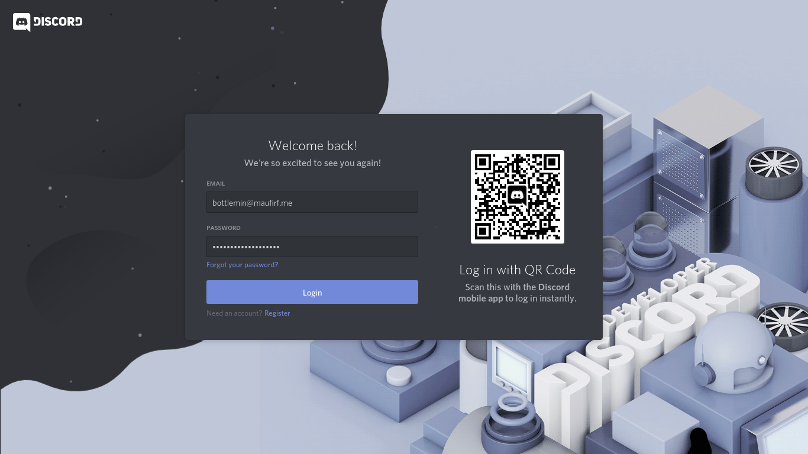
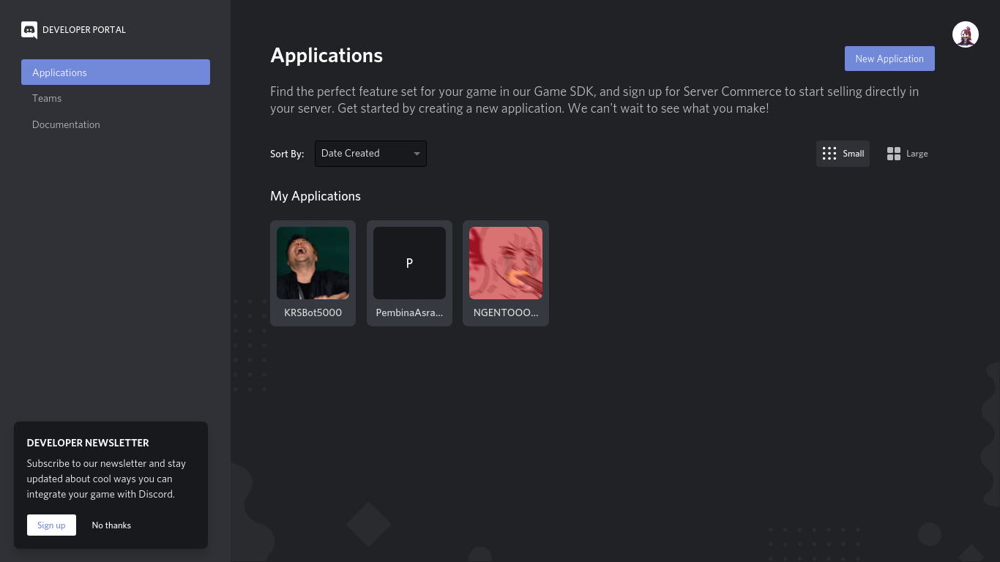
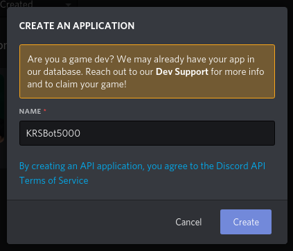
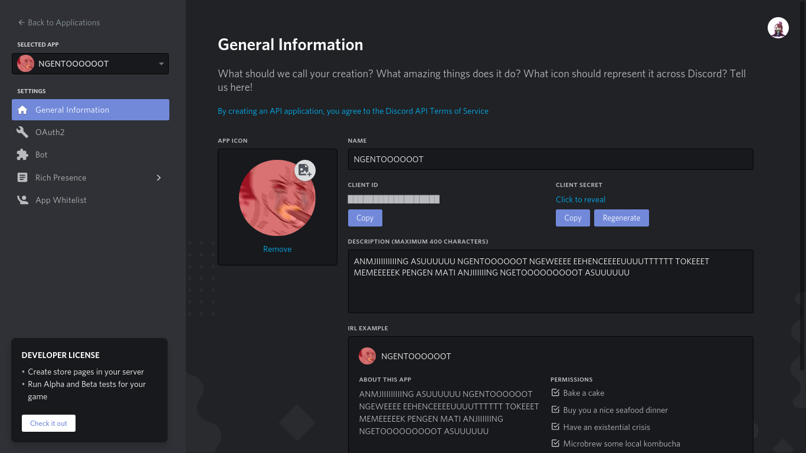
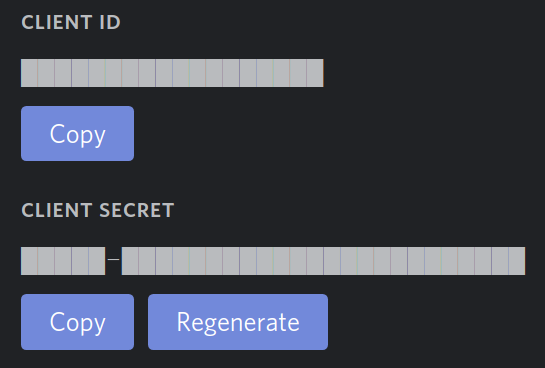
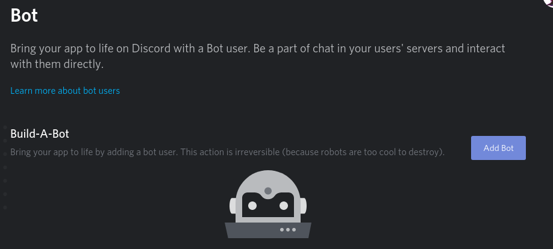
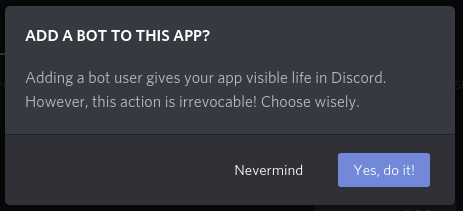
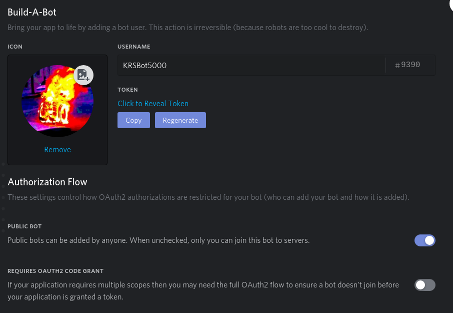

<style>
    .img-subtitle {
        font-size:11px;
        text-align:center;
        font-style:italic;
    }
</style>
# Python Bot Quick Guide (ID)
Ini adalah panduan cepat untuk membuat bot Facebook, Twitter, dan Discord. Panduan ini Berbahasa Indonesia. Kunjungi semua bot sosial media yang saya buat di [maufirf.me/Bottlemin-Bots](http://maufirf.me/Bottlemin-Bots).

_Disklaimer: Panduan ini tidak sepenuhnya menggunakan istilah dalam Bahasa Indonesia karena kadang kata-kata yang dipaksakan untuk diserap ke dalam Bahasa Indonesia terlihat bodoh atau sulit diucapkan. Contohnya "Grayscale image" menjadi "Citra Skala Keabuan". Jujur saja itu terdengar bodoh di telinga saya. Ditambah, saya juga tidak akan sepenuhnya mengikuti PUEBI dan menulis panduan ini sesuka hati saya._

_Saya dengan senang hati jika anda memiliki pertanyaan, namun biasakan diri anda untuk membaca terlebih dahulu. Saya akan lampirkan server Discord saya di sini ketika sudah dibuka untuk publik._

-------------

**Selamat datang di panduan cepat membuat bot sosial media ini!**<br/>
Panduan ini tidak membahas lengkap tentang pembuatan bot sampai ke akar, karena tujuan utama dari panduan ini adalah untuk mendeploy bot secara cepat kurang dari 3 jam. Pengembangan bot akan diserahkan sepenuhnya kepada pembaca. Panduan lengkap akan dibuat di situs ini, ketika panduan lengkap sudah dirilis, saya akan memberi kabar di [akun Facebook pribadi saya](https://fb.me/auficertepaja).

Outline panduan pembuatan bot ini melingkupi:
- Pemrograman di **Python**;
- Menggunakan _developer tools_ yang disediakan **Facebook**, **Twitter**, atau **Discord**;
- Menyambungkan akun sosial media bot dengan programnya;
- Menaruh program bot di tempat hosting **Heroku** agar tidak perlu menyalakan dan menggoreng komputer anda karena harus nyala 24 jam x 7 hari; dan
- Moderasi posting.

Kalau kalian mengkategorikan diri kalian sebagai professional (dalam artian membuat bot dengan skala yang lebih besar secara vertikal), anda bisa juga membaca bagian professional notes.

Ketika saya sudah jago bikin bot di JavaScript, nanti saya perbaharui deh.

Prasyarat pembuatan bot ini adalah (syarat-syarat ini terserah mau anda penuhi atau tidak kalau punya preferensi sendiri, tapi ya kalau mau ikutin panduan ini, ini yang saya pake):
- Pengetahuan dasar pemrograman dengan bahasa **Python** berserta Pythonnya sendiri di komputer anda. Python dapat anda unduh [di situsnya](https://www.python.org/downloads/), namun saya juga menyarankan untuk lebih memilih [mengunduh Anaconda](https://www.anaconda.com/distribution/) dibanding Python biasa, karena Anaconda adalah Python biasa namun sebagian besar tools sudah lengkap bersama unduhannya.
- Akun di salah satu situs tujuan deployment anda, **[Facebook](https://fb.com)**, **[Twitter](https://twitter.com)**, atau **[Discord](https://discordapp.com)**.
- Akun di tempat hosting **[Heroku](https://heroku.com)**
- Ke-anti-mager-an untuk membaca dokumentasi. Serius.
- _(OPSIONAL)_ Pengetahuan dasar **pemrograman berbasis objek**. Sebenarnya nggak perlu banget sih, tapi kalau bisa yah lebih enak jelasinnya.
- _(OPSIONAL)_ Kartu debit dengan saldo setidaknya Rp.16.000,00. Kalau lebih mah terserah, kalau pake kartu kredit mah silahkan, mau teriak ke saya ***"PERSETAN KARO ATURAN, AKU IKI WONG SUGIH"*** mah saya terima. CATATAN: tidak akan menggunakan saldo yang ada miliki kok, kecuali kalau anda wong sugih ya, sila...
- <sub><sub>_(OPSIONAL, TAPI BENERAN NGGAK PENTING-PENTING BANGET)_ Kartu x-card jenius. belum punya? silahkan ke [situsnya](https://www.jenius.com/) buat bikin yha~</sub></sub>

--------

## Pemrograman Di Python

### Pengenalan dan persiapan

Dalam panduan ini, saya mencoba untuk menurunkan knowledge base saya sebawah mungkin agar panduan ini dapat diikuti sekalipun anda bukan ~~wibu ilkom~~ programmer. Alasan saya memilih python ada 2:
1. Tentunya karena python adalah bahasa yang sering saya gunakan ketika membuat bot
2. Python adalah bahasa yang mudah dipelajari oleh pemula

Di internet, kebanyakan programmer membuat botnya di bahasa **JavaScript**, menggunakan NodeJS. Alasan utamanya karena sangat membantu dalam membentuk komunikasi dari komputer dimana programnya berada ke sosial media. Dengan JavaScript, anda bisa lebih leluasa membuat fungsi-fungsi yang anda inginkan, hanya saja dengan tuntutan lebih mandiri dalam melakukan semua hal dan butuh pengetahuan yang lebih mendalam.

Saya asumsikan anda telah menginstall Python di komputer anda. Kali ini kita akan mencoba untuk mengenali lingkungan pemrograman anda, yang berikutnya akan saya sebut _environment_.

Jika anda sudah mengerti Python bersama environmentnya, anda bisa langsung skip ke bagian [library](#). Kalau belum, silahkan buka bagian ini untuk membaca lebih lanjut:

<details>
    <summary>Penjelasan Python dan environmentnya</summary>
    Python adalah bahasa <i>interpreter</i>. Artinya, anda dapat mengetik satu baris sintaks ke dalam python, dan python akan langsung memproses secara real-time, sama seperti namanya. Ada lagi bahasa <i>compiler</i> yang membaca semua sintaks terlebih dahulu dan baru menjalankannya.<br/>
    <br/>
    Karena itu, anda bisa mulai mencoba menggunakan interpreter dari Python dengan salah satu cara di bawah ini:<br/>
    <br/>
    <b>Di Windows</b>:
    <ul>
        <li>Buka start menu, cari <code>IDLE</code>, dan buka; atau</li>
        <li>Buka Command Prompt dengan menekan, lalu ketik <code>idle</code>, lalu tekan <kbd>⏎ Enter</kbd></li>
    </ul>
    <b>Di Linux</b>:<br/>
    <i>Duh maaf sekali dari situs resminya nggak dikasih :(</i>. Gantinya, kita bisa membuka interpreternya di Terminal. Buka terminal anda dan ketik <code>python3</code> (atau pada beberapa kasus, seperti jika anda menggunakan Anaconda, <code>python</code>) untuk memastikan anda membuka Python versi 3.x.x lalu tekan <kbd>⏎ Enter</kbd>.<br/>
    <br/>
    Sekarang, kita sudah bisa mencoba melakukan pemrograman di python. Ada beberapa hal yang harus kita coba. Perlu diingat ini ini bukan panduan pemrograman dasar, jadi saya tidak akan banyak jelasin yang sifatnya dasar, namun saya akan mencoba yang terbaik.<br/>
    <ul>
        <li>
            <b>Operasi dasar</b><br/>
            Cobalah untuk mengetik ini di interpreter anda:<br/>
            <code>10 + 4</code><br/>
            Interpreter anda akan langsung mengeluarkan <code>14</code>. Operasi dasar ini bekerja untuk operasi dengan operator lainnya seperti <code>-</code>, <code>*</code>, dan <code>/</code>. Bisa anda baca di <a href="https://docs.python.org/3/library/operator.html#mapping-operators-to-functions">di dokumentasinya</a>
        </li>
        <li>
            <b>Variabel</b><br/>
            Saya yakin saat SMP anda sudah pernah belajar variabel. Kita dapat menggunakannya juga di pemrograman untuk menyimpan sebuah nilai. Sekarang coba ketik ini di interpreter anda, satu setiap baris:<br/>
            <code>a = 22</code><br/>
            <code>b = 6</code><br/>
            <code>a - b</code><br/>
            Interpreter anda akan mengeluarkan hasil <code>16</code>. Anda juga dapat langsung menyimpan hasil perhitungan variabel ke dalam variabel lagi seperti <code>c = a + b</code>.
        </li>
        <li>
            <b>Fungsi</b><br/>
            Fungsi tujuannya adalah untuk menyimpan berbagai set operasi agar dapat digunakan dimanapun tanpa mengetik semua operasinya lagi. Coba ketikkan ini di interpreter anda<br/>
            <pre>
def kali_dua_variabel(nilai1, nilai2):
    hasil = nilai1 * nilai2
    return hasil
            </pre><br/>
            lalu, coba gunakan fungsinya:<br/>
            <code>kaliDuaVariabel(23, 3)</code><br/>
            Interpreter akan mengeluarkan hasil 69. Nice. Anda juga bisa Mari kita bedah sususan fungsi itu:<br/>
            <code>def</code> adalah sintaks untuk mendefinisikan <i>"ini adalah fungsi"</i>. satu kata setelahnya akan dianggap nama fungsi, dan dalam kasus kita, kita membuat fungsi dengan nama <code>kali_dua_variabel</code>.<br/>
            Tanda kurung setelah nama (<code>(nilai1, nilai2)</code>) disebut parameter, yakni nilai input yang akan digunakan dalam fungsi. Di dalam kurung parameter itu, ada dua variabel parameter, yakni <code>nilai1</code> dan <code>nilai2</code>. Di dalam fungsi, dua parameter tersebut dapat dianggap sebagai variabel.<br/>
            <code>return</code> adalah sintaks yang menandakan <i>"Apapun yang diketik setelah ini adalah hasil yang akan dikeluarkan sebagai output fungsi."</i>. Dalam kasus kita, variabel <code>hasil</code> adalah variabel yang kita keluarkan dari fungsi sebagai hasil.
        </li>
        <li>
            <b>Modules & Library</b><br/>
            Modules bahasa mudahnya adalah folder, file, atau apapun yang membungkus kode. Untuk melihat apa yang kita maksud, kita akan mencoba membuat dua file pada python.<br/>
            File pertama, <code>file_sumber.py</code>, dan isi dengan:
            <pre>
def fungsi_contoh():
    return "hore"

def kali_dua_variabel(a, b):
    return a * b
            </pre>
            lalu pada file kedua, <code>file_tujuan.py</code>, isi dengan:
            <pre>
import file_sumber
from math import sin, cos, pi

print(file_sumber.fungsi_contoh())
print(file_sumber.kali_dua_variabel(10, 3))

def komponen_vektor(jarak, sudut):
    """
    Fungsi ini berguna untuk mereduksi vektor menjadi komponen x dan y
    """
    sudut_radian = (sudut / 180) * pi
    x = jarak * sin(sudut_radian)
    y = jarak * cos(sudut_radian)
    komponen = [round(x), round(y)]
    return komponen

print(komponen_vektor(5, 37))
            </pre>
            Jika kita jalankan file kedua, akan keluar tiga baris hasil. Dua pertama, <code>hore</code> dan <code>30</code> adalah keluaran dari fungsi yang kita tulis di file pertama. Padahal, file yang dijalankan adalah file kedua. Disitulah gunanya baris yang paling atas (<code>import file_sumber</code>: Untuk menggunakan apapun yang kita buat di fungsi pertama. Sintaks <code>import</code> gunanya untuk memasukkan fungsionalitas modul yang kita taruh di tempat lain. Dalam kasus kita, <code>file_sumber</code> adalah nama modul yang kita masukkan. Dengan kata lain, Python menganggap file Python sebagai modul.<br/>
            Perhatikan baris kedua dari file kedua (<code>from math import sin, cos, pi</code>). Itu merupakan sintaks lain dengan tujuan yang sama. <code>from</code> bertujuan untuk menunjuk dari modul mana yang ingin kita masukkan, dan setelah <code>import</code> kita menentukan <b>secara spesifik</b> fungsi atau variabel apa saja yang ingin kita masukkan. Lho, padahal kita tidak menulis file <code>math.py</code>? jawabannya, modul <code>math</code> adalah modul yang telah kita daftarkan sebagai _Library_. Modul tersebut disimpan di direktori instalasi Python sehingga bisa digunakan di file python yang kita buat kapanpun dimanapun. Kesimpulannya, library adalah modul-modul program yang sudah jadi yang ditaruh di direktori utama python.
        </li>
    </ul>
    <i>Sisanya, anda bisa pelajari dari kursus daring pemrograman yang ada di internet. Saya sendiri mempelajarinya dari kampus. Namun jika anda tidak mempelajari ini di sekolah atau kampus, anda dapat mencoba mencari situs kursus pemrograman. Saya tidak hafal situs sejenis di Indonesia, tapi saya menggunakan <a href="https://codeabbey.com">Code Abbey</a> dan <a href="https://codecademy.com">Codecademy</a> jika anda tertarik. Keduanya gratis, hanya saja yang kedua kalau mau fitur tambahan, anda harus bayar.</i>
</details>

### Library

Dalam menggunakan bahasa pemrograman, menggunakan library sudah menjadi hal yang tak terelakkan karena dapat memudahkan kita, tidak mengharuskan kita mengetik kode benar-benar dari nol. Karena kita akan melibatkan beberapa library, kita membutuhkan package manager. Package manager bekerja sesuai namanya: membantu kita mengatur package dan library, karena jika kita lakukan sendiri, itu akan sulit dan beresiko kita merusak instalasi python kita.

Package manager di python adalah `pip`. Seharusnya, `pip` sudah terinstall pada detik anda menginstall Python. sebaiknya kita pastikan `pip` sudah terinstall terlebih dahulu karena kita akan menggunakannya untuk menginstall library yang kita butuhkan. Ketik ini di command prompt (untuk windows) atau terminal (untuk linux):
```bash
pip --version
```
Jika terinstall dengan betul, maka konsol akan mengeluarkan sesuatu seperti:
```
pip 19.0.3 from /home/maufirf/anaconda3/lib/python3.7/site-packages/pip (python 3.7)
```
Jika anda menggunakan Anaconda, maka anda juga dapat menggunakan package manager dari anaconda, `conda` untuk mengunduh library.

Sekarang, kita akan menginstall library yang kita butuhkan. Sebelumnya, mari kita lihat apa saja yang kita unduh. Anda dapat menginstall yang anda butuhkan saja, semuanya, atau tidak sama sekali. Terserah sih:

- **[Tweepy](https://tweepy.org)**<br/>Tweepy adalah library API wrapper yang kita gunakan untuk menggunakan API yang diberikan oleh Twitter untuk kita. Dengan API yang diberikan itu, kita bisa nge-tweet, mencari, atau menghapus tweet menggunakan pemrograman. Untuk menginstall Tweepy, kita bisa mengetik ini di konsol untuk menginstall:
    ```
    pip install tweepy
    ```
    Anda bisa mempelajarinya lebih lanjut di [dokumentasinya](http://docs.tweepy.org/en/latest/index.html).
- **[Facebook-SDK](https://facebook-sdk.readthedocs.io/en/latest/)**<br/>Facebook-SDK adalah library API wrapper yang kita gunakan untuk menggunakan API yang diberikan oleh Facebook. Kurang lebih sama seperti Tweepy, hanya saja untuk facebook. Untuk menginstall, anda dapat mengetik ini di konsol untuk menginstall:
    ```
    pip install facebook-sdk
    ```
    Baca [dokumentasinya](https://facebook-sdk.readthedocs.io/en/latest/install.html) untuk informasi lebih lanjut.
- **[Discord.py](https://discordpy.readthedocs.io/en/latest/)**<br/>sama kayak sebelumnya tapi buat Discord. nih, capek juga gue ngetiknya:
    ```
    pip install -U discord.py
    ```
    Jika ingin menggunakan voice supportnya, silahkan gunakan yang ini:
    ```
    pip install -U discord.py[voice]
    ```
    baca [dokumentasinya](https://discordpy.readthedocs.io/en/latest/intro.html#installing) untuk informasi yang lebih lengkap.

dan untuk mengimport library tersebut, silahkan coba tes di interpreter:
```python
import tweepy
import facebook
import discord
```
Jika tidak ada error, maka semuanya bekerja dengan betul.

## Social Media Linking

### Application Program Interface (API)

**API** mudahnya adalah sebuah gerbang yang mengizinkan siapapun yang menggunakannya untuk memanfaatkan program yang dibuat di tempat tertentu untuk digunakan di tempat lain. Berbeda dengan library, kita tidak mengunduh programnya untuk menggunakannya. Kita cukup mengirimkan data input, dan kita akan dikirimkan kembali outputnya untuk kita pakai.

Lantas, _mengapa di langkah sebelumnya kita mendownload library dari ketiga sosmed tersebut? Berarti sebetulnya kita tidak perlu mengunduh library dong? kita dibohongin, dong?_ **Tidak**, jawabnya. Karena untuk menggunakan API, kita harus bisa mengirimkan data dari program kita secara mandiri, dan jika kita lakukan sendiri akan memakan waktu dan harus terbiasa menggunakan konsep pemrograman yang tidak memiliki karakteristik yang sama dengan ciri khas bahasa yang kita gunakan, _kecuali kalau menggunakan JavaScript dan PHP karena mereka adalah bahasa pemrograman berbasis web yang unggul di bidang itu_. Karenanya, kita butuh **program yang membantu kita menggunakan API mentah yang disediakan sosmed yang membuat kita dapat menggunakan API tersebut tanpa lepas dari ciri khas bahasa yang kita gunakan**. Library yang memuat program demikian lazim disebut sebagai **API Wrapper**. Dan, ketiga library tadi, adalah API wrapper dari sosmed yang bersangkutan.

### Access token

Masing-masing sosial media memiliki protokolnya sendiri untuk mengurus automasi postingan dengan pemrograman. Namun hampir semua media sosial memiliki template langkah-langkah yang sejenis:

1. **Mendaftarkan** diri sebagai developer di situsnya
2. **Mendapatkan** kode API
3. **Menggunakan** kode API di setiap komunikasi yang terjadi antara kita dengan situsnya

Kode API, atau kita juga kadang menyebutnya dengan acess token, atau token saja, adalah cara lain untuk mengenali seseorang atau sesuatu yang mengontrol akunnya di sosial medianya tanpa harus login. untuk mendapatkan token, biasanya dengan satu kali login saja, token yang didapat dari situ biasanya bertahan hampir selamanya untuk digunakan.

_KARENA ITU, TOLONG PERLAKUKAN ACCESS TOKEN ANDA LAYAKNYA PASSWORD, SOALNYA SAYA PERNAH HARD-CODE ACCESS TOKEN GUE DI FILE KODINGAN TERUS UPLOAD KE REPOSITORI PUBLIK **TERUS SERVER DISCORD GUE KE-HACK DONG**_ :((( Ada caranya buat nyembunyiin access token, nanti saya kasih tahu kok.

Hanya saja, tingkat kesulitan dan cara mendapatkan token itu berbeda-beda di setiap situs. Ini ranking yang saya buat berdasarkan kesulitan mendapatkan token, diurutkan dari tingkat yang paling mudah. Asumsi yang harus saya sampaikan disini adalah mendapat tokennya secara mandiri:

1. Discord - Sangat mudah
2. Twitter - Tidak susah, hanya agak lama saja
3. Facebook - Demi tuhan ini ngajak ribut banget allahuakbar.

Karenanya, untuk beberapa sosmed, ada tools tambahan yang dapat anda gunakan untuk mempermudah mendapatkan token, terutama Facebook. ~~Mark Zuckerberg bangsat emang.~~

Ayo kita coba dapatkan access token dimulai dari yang termudah

#### Discord

Discord adalah social network yang paling bersahabat dengan bot developer di antara ketiga network lainnya. Mendapatkan access token semudah mengklik-klik saja.

Pertama, masuk ke situs pengembangnya yang berada di [https://discordapp.com/developers](https://discordapp.com/developers/applications/) dan lakukan login.
[](https://discordapp.com/developers/applications/)
<p class="img-subtitle">Tampilan laman login dari situs developer discord</p>

Setelah login selesai dilakukan, kalian akan masuk ke panel aplikasi. Di panel ini, kalian bisa melihat aplikasi apa saja yang sudah kalian buat di Discord. Sebelum melanjutkan, saya perlu menjelaskan maksud _aplikasi_ di sini.

<details>
    <summary style="font-style:italic">Baca maksud dari aplikasi discord dengan membuka spoiler ini.</summary>
    Aplikasi discord adalah aplikasi yang digunakan untuk mendapatkan data-data user. Misalnya, untuk <a href="https://twitch.tv">Twitch.tv</a>, anda dapat menyambungkan akun Discord anda ke Twitch agar anda dapat memiliki role "<a style="color:#6441a5;font-weight:bold">Twitch Subscriber</a>" di server Discord dari streamer Twitch favorit anda, seperti <a href="https://discord.gg/callmecarson">server discord dari CallMeCarson</a>. Cara kerjanya adalah aplikasi discord Twitch mendapatkan username discord anda setelah anda mengizinkan untuk menghubungkan discord anda dengan twitch, lalu mengecek apakah anda subscriber dari streamer tertentu, dan jika iya aplikasinya akan mengirimkan data ke Discord, tepatnya ke server streamer anda, kalau anda adalah subscriber discord tertentu. Lalu, discord akan secara otomatis memberikan anda role tersebut setelah diberitahu applikasi discord dari Twitch.<br/>
    <br/>
    Jadi, aplikasi discord tidak spesifik untuk membuat bot, anda dapat mengintegrasikan dengan program anda, terutama jika program anda adalah game karena discord telah mendesain APInya untuk benar-benar memuat resource yang lengkap untuk kebutuhan game anda dalam membuat interaksi yang sempurna bagi pengguna game anda.<br/>
    <br/>
    Tapi tenang saja, aplikasi discord juga mendesain APInya khusus untuk developer chatbot. Anda mendapatkan satu akun bot setiap satu aplikasi yang anda buat di Discord. formatnya sama persis seperti username user lainnya (username#1234). Anda dapat mengganti usernamenya, namun tidak dengan angkanya.
</details><br/>

Pertama, buatlah aplikasi discord jika belum membuatnya. Terdapat tombol <kbd>New Application</kbd> di pojok kanan atas. tekan dan anda akan ditanya apa nama aplikasinya. Nama aplikasi tidak harus nama bot anda, karena anda mendefinisikan nama bot anda nanti.<br/>



<p class="img-subtitle">Panel developer discord. Tekan tombol <b>New Application</b> untuk membuat aplikasi baru</p>

<p align="center"></p>
<p class="img-subtitle">Prompt ketika anda menekan tombol itu. Masukkan nama aplikasi anda. Tidak harus nama bot anda, karena ditentukan nanti.</p>


<p class="img-subtitle">Panel aplikasi setelah selesai menentukan nama aplikasi</p>

Penting, namun tidak terlalu relevan dengan access token bot kita: setelah membuat aplikasi, perhatikan bagian yang bertuliskan Client ID dan Client Secret anda. Bagian itu rahasia namun dengan tingkat yang berurutan tidak terlalu rahasia dan lumayan rahasia. Usahakan tidak menunjukkan Client Secret anda pada siapapun bagaimanapun. Terlebih, jika anda mengetahui aplikasi (tidak hanya bot) anda dibajak, sesegera mungkin regenerasikan client secret anda dengan menggunakan tombol <kbd>Regenerate </kbd> di bagian Client Secret. Kedua hal itu anda gunakan jika anda butuh data dari user untuk diintegrasikan ke aplikasi anda, yang dalam hal ini

<p align="center"></p>
<p class="img-subtitle">Bagian Client ID dan Client Secret yang telah disensor, namun tetap menunjukkan pola kode utamanya.</p>

Sekarang, lihat di panel bagian kiri dan pilih opsi **<svg viewBox="0 0 22 22" name="Jigsaw" width="16px" height="16px" color="currentColor"><path fill="currentColor" d="M20.5,11H19V7c0-1.1-0.9-2-2-2h-4V3.5C13,2.1,11.9,1,10.5,1S8,2.1,8,3.5V5H4C2.9,5,2,5.9,2,7v3.8h1.5 c1.5,0,2.7,1.2,2.7,2.7S5,16.2,3.5,16.2H2V20c0,1.1,0.9,2,2,2h3.8v-1.5c0-1.5,1.2-2.7,2.7-2.7s2.7,1.2,2.7,2.7V22H17 c1.1,0,2-0.9,2-2v-4h1.5c1.4,0,2.5-1.1,2.5-2.5S21.9,11,20.5,11L20.5,11z"></path></svg> Bot** untuk membuat user bot baru.

<p align="center"></p>
<p class="img-subtitle">Panel bot sebelum bot dibuat</p>

Tekan <kbd>Add Bot</kbd> untuk menambah bot baru. Anda diberitahu jika sekali membuat bot, anda tidak dapat menghapus asosiasi bot anda dengan aplikasi anda, jadi bot akan selalu ada jika aplikasi anda juga ada.

<p align="center"></p>
<p class="img-subtitle">Prompt pembuatan bot anda. Anda tahu, kan kalau anda mau buat bot anda akan menekan <b>"Yes, do it!"</b> untuk membuat bot baru? saya harap anda benar-benar tahu atau harusnya anda malu dengan gelar sarjana anda dan masih saja tidak bisa mengikuti instruksi padahal sudah disajikan di depan mata anda sendiri. Kalau anda masih sekolah, anda tidak apa-apa, hanya saja guru anda tidak mengajarkan anda soft-skill psikomotorik untuk memahami instruksi dan saya akan menyalahkan beliau.</p>

Kalau sudah membuat bot, sekarang anda tinggal memberi nama bot anda, dan gambar jika anda ingin. Access tokennya? sudah di depan mata anda dan siap dipakai!


<p class="img-subtitle">Panel discord bot setelah bot dibuat.</p>

_Kenapa sampai detik ini belum ada speedrun dapetin access token discord, njir?_

#### Twitter

Twitter adalah social network yang juga ramah kepada bot developer. Twitter mengakui keberadaan bot di jaringannya dan ingin membantu anda sepenuhnya baik urusan bisnis ataupun cuma sekedar hobi. Tidak seperti Discord, Twitter akan memfilter developer yang mendaftar tergantung tujuannya. Twitter juga akan mewawancarakan data apa saja yang ingin anda dapatkan dari Twitter.

_Ini adalah akhir dari panduan ini untuk sementara. Sisanya sedang diketik._